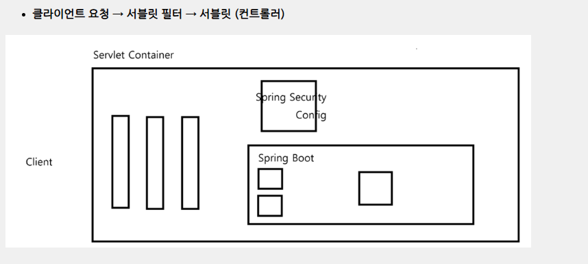
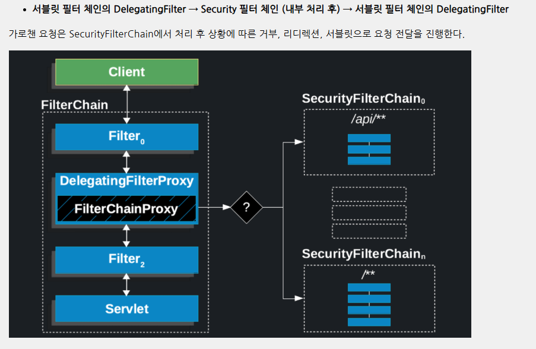

### 실습 목표
1. 스프링 시큐리티 프레임워크를 활용한 인증/인가를 구현하고 회원 정보 저장은 MySQL 데이터베이스를 활용하여 구현
---
2. 스프링 시큐리티 6 프레임워크를 활용하여 JWT 기반의 인증/인가를 구현하고 회원 정보 저장(영속성) MySQL 데이터베이스를 활용

### 구현
* 인증: 로그인
* 인가: 경로별 접근 권한
* 회원가입

---
* 인증 : 로그인
* 인가 : JWT를 통한 경로별 접근 권한
* 회원가입

### 버전
- Spring Boot 3.1.5
- Security 6.1.5
- Spring Data JPA - MySQL
- mustache
- IntelliJ Ultimate

### 동작 원리
- Spring Security Config 설정 시 Filter를 생성하여 처리

### 인가
특정한 경로에 요청이 오면 Controller 클래스에 도달하기전 필터에서 Spring Security가 검증

1. 해당 경로의 접근은 누구에게 열려 있는지?
2. 로그인이 완료된 사용자인지?
3. 해당되는 role을 가지고 있는지?

### Config 설정 후 로그인 페이지
스프링 시큐리티 Config 클래스 설정 후 특정 경로에 대한 접근 권한이 없는 경우 자동으로 로그인 페이지로 리다이렉팅 되지 않고 오류 페이지가 발생

위 문제 해결을 위해 Config 클래스를 설정하면 로그인 페이지 설정도 진행해야 함

### 시큐리티 암호화
스프링 시큐리티는 사용자 인증시 비밀번호에 대해 단방향 해시 암호화를 진행하여 저장되어 있는 비밀번호와 대조
따라서 회원가입시 비밀번호 항목에 대해서 암호화를 진행해야 함

스프링 시큐리티는 암호화를 위해 BCrypt Password Encoder를 제공하고 권장
@Bean으로 등록하여 사용

### 단방향 해시 암호화
* 양방향
  * 대칭키
  * 비대칭키
* 단방향
  * 해시

### 데이터 베이스 변수 설정(application.properties)
* spring.datasource.driver-class-name=com.mysql.cj.jdbc.Driver
* spring.datasource.url=jdbc:mysql://아이피:3306/데이터베이스?useSSL=false&useUnicode=true&serverTimezone=Asia/Seoul&allowPublicKeyRetrieval=true
* spring.datasource.username=아이디
* spring.datasource.password=비밀번호

### 회원가입 로직 구현시 주의점
* 백/프론트 양쪽에서 회원가입 아이디 중복 확인 로직이 필요
* 아이디, 비밀번호에 대한 정규식 처리도 필요

### 인증
시큐리티를 통해 인증을 진행하는 방법은 사용자가 Login페이지를 통해 아이디, 비밀번호를
POST요청시 스프링 시큐리티가 데이터베이스에 저장된 회원정보를 조회 후 비밀번호를 검증하고
서버 세션 저장소에 해당 아이디에 대한 세션을 저장한다.

### 세션 현재 사용자 아이디
SecurityContextHolder.getContext().getAuthentication().getName();

### 로그인 정보
사용자가 로그인을 진행한 뒤 사용자 정보는 SecurityContextHolder에 의해서 서버 세션에 관리된다.

### 세션 소멸 시간 설정(application.properties)(기본 시간 1800초)
//초 기반
server.servlet.session.timeout=1800

//분 기반
server.servlet.session.timeout=90m

### 다중 로그인 설정
동일한 아이디로 다중 로그인을 진행할 경우에 대핸 세션 통제가 필요
* sessionManagement() 메소드를 통한 설정을 진행한다.
* maximumSession(정수) : 하나의 아이디에 대한 다중 로그인 허용 개수
* maxSessionPreventsLogin(불린) : 다중 로그인 개수를 초과하였을 경우 처리 방법
  * true : 초과시 새로운 로그인 차단
  * false : 초과시 기존 세션 하나 삭제

### 세션 고정 보호
세션 고정 공격을 보호하기 위한 로그인 성공시 세션 설정 방법
* sessionManagement().sessionFixation().none() : 로그인 시 세션 정보 변경 안함
* sessionManagement().sessionFixation().newSession() : 로그인 시 세션 새로 생성
* sessionManagement().sessionFixation().changeSessionId() : 로그인 시 동일한 세션에 대한 id 변경

### CSRF란?
CSRF(Cross-Site Request Forgery)는 요청을 위조하여 사용자가 원하지 않아도 서버측으로 특정 요청을 강제로 보내는 방식이다. (회원 정보 변경, 게시글 CRUD를 사용자 모르게 요청)

### CSRF 토근 검증 요청 방법
- form 형식 기준
```xml
<form action="/loginReceiver" method="post" name="loginForm">
    <input type="text" name="username" placeholder="아이디"/>
    <input type="password" name="password" placeholder="비밀번호"/>
    <input type="hidden" name="_csrf" value="{{_csrf.token}}"/>
    <input type="submit" value="로그인"/>
</form>
```
- ajax 요청
```xml
<meta name="_csrf" content="{{_csrf.token}}"/>
<meta name="_csrf_header" content="{{_csrf.headerName}}"/>
```

-mustache에서 csrf 토큰 변수 오류 발생시 아래 구문을 변수 설정 파일에 추가
```
spring.mustache.servlet.expose-request-attributes=true
```
### CSRF 설정시 GET 방식으로 로그아웃 진행 설정
- security config 클래스 로그아웃 설정
```java
@Bean
public SecurityFilterChain securityFilterChain(HttpSecurity http) throws Exception{

  http
          .logout((auth) -> auth.logoutUrl("/logout")
                  .logoutSuccessUrl("/"));

  return http.build();
}
```
- LogoutController
```java
@Controller
public class logoutController {

    @GetMapping("/logout")
    public String logout(HttpServletRequest request, HttpServletResponse response) throws Exception {

        Authentication authentication = SecurityContextHolder.getContext().getAuthentication();
        if(authentication != null) {
            new SecurityContextLogoutHandler().logout(request, response, authentication);
        }

        return "redirect:/";
    }
}
```

### API 서버의 경우 csrf.disable() ?
앱에서 사용하는 API 서버의 경우 보통 세션을 STATELESS로 관리하기 때문에 스프링 시큐리티 csrf enable 설정을 진행하지 않아도 된다.

### 소수의 유저를 저장할 좋은 방법?
토이 프로젝트를 진행하는 경우 또는 시큐리티 로그인 환경이 필요하지만 소수의 회원 정보만 가지며 데이터베이스라는 자원을 투자하기 힘든 경우는 회원가입 없는 InMemory 방식으로 유저를 저장

이 경우 InMemoryUserDetailsManager 클래스를 통해 유저를 등록

### Http Basic 인증 방식
Http Basic 인증 방식은 아이디와 비밀번호를 Base64 방식으로 인코딩한 뒤 HTTP 인증 헤더에 부착하여 서버측으로 요청을 보내는 방식

### HttpBasic 방식 인증을 위한 Config 클래스 설정
```java
@Bean
public SecurityFilterChain filterChain(HttpSecurity http) throws Exception{

    http
            .httpBasic(Customizer.withDefaults());

    return http.build();
}
```

### 계층 권한 : Role Hierarchy
권한 A, 권한 B, 권한 C가 존재하고 권한의 계층은 “A < B < C”라고 설정을 진행하고 싶은 경우 RoleHierarchy 설정을 진행

- 계층 권한 메소드 등록
```java
@Bean
public RoleHierarchy roleHierarchy() {

  RoleHierarchyImpl hierarchy = new RoleHierarchyImpl();

  hierarchy.setHierarchy("ROLE_C > ROLE_B\n" +
          "ROLE_B > ROLE_A");

  return hierarchy;
}
```

### JWT 필수 의존성
JWT 토큰을 생성하고 관리하기 위해 JWT 의존성을 필수적으로 설정해야 합니다.
* implementation 'io.jsonwebtoken:jjwt-api:0.12.3'
* implementation 'io.jsonwebtoken:jjwt-impl:0.12.3'
* implementation 'io.jsonwebtoken:jjwt-jackson:0.12.3'

### API 서버와 요청 클라이언트
API 서버는 웹서버와 달리 서버측으로 요청을 보낼 수 있는 페이지가 존재하지 않고 엔드 포인트만 존재하기 때문에 요청을 보낼 API 클라이언트가 필요

### 스프링 시큐리티 필터 동작
스프링 시큐리티는 클라이언트의 요청이 여러개의 필터를 거쳐 DispatcherServlet(Controller)으로 향하는 중간 필터에서 요청을 가로챈 후 검증(인증/인가)을 진행



- Delegating Filter Proxy


### Form 로그인 방식에서 UsernamePasswordAuthenticationFilter
Form 로그인 방식에서는 클라이언트단이 username과 password를 전송한 뒤 Security 필터를 통과하는데 UsernamePasswordAuthentication 필터에서 회원 검증을 진행

현재는 API방식은 FormLogin 방식을 사용하지 않기 때문에 해당 필터를 커스텀하여 등록해야 함

### JWT 발급과 검증
- 로그인시 → 성공 → JWT 발급
- 접근시 → JWT 검증

### JWT
JWT는 Header.Payload.Signature 구조로 이루어져 있다. 각 요소는 다음 기능을 수행
* Header
  * JWT임을 명시
  * 사용된 암호화 알고리즘
* Payload
  * 정보
* Signature
  * 암호화알고리즘((BASE64(Header))+(BASE64(Payload)) + 암호화키)

JWT의 특징은 내부 정보를 단순 BASE64 방식으로 인코딩하기 때문에 외부에서 쉽게 디코딩 할 수 있다.

외부에서 열람해도 되는 정보를 담아야하며, 토큰 자체의 발급처를 확인하기 위해서 사용한다.

### 암호화 키 저장
암호화 키는 하드코딩 방식으로 구현 내부에 탑재하는 것을 지양하기 때문에 변수 설정 파일에 저장

### JWTUtil
* 토큰 Payload에 저장될 정보
  * username
  * role
  * 생성일
  * 만료일
* JWTUtil 구현 메소드
  * JWTUtil 생성자
  * username 확인 메소드
  * role 확인 메소드
  * 만료일 확인 메소드


